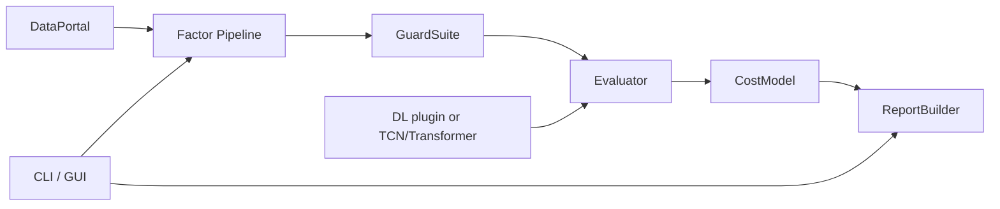

# Alpha-Lab

Alpha-Lab 是一个面向量化因子研究的工程化工具链，提供从数据读取、因子构建、风险检查、评估到报告输出的完整流程。

## 项目目标

- 提供可复现的因子研究流程
- 将常见研究步骤标准化（配置化、可测试、可回归）
- 支持从传统因子到深度学习因子的统一评估链路

## 核心能力

- 数据层：支持 `daily`/`minute` 两种频率，支持 Parquet / Arrow IPC(含 Feather)
- 因子层：内置 `rolling_mean`、`rolling_std`、`rank`、`zscore`、`decay_linear`、`winsorize`、`neutralize`
- Guard 层：前视算子规则检查、可交易性过滤、复权处理
- 评估层：IC / RankIC、分层收益、多空收益、换手、稳定性、walk-forward、归因、成本后净收益
- 报告层：自动生成 HTML 报告及 CSV/图表工件
- 运行入口：CLI + PyQt6 GUI
- DL 扩展：兼容轻量插件 + 支持 TCN/Transformer 训练与推理流程

## 架构概览



## 安装

```bash
python -m venv .venv
source .venv/bin/activate
pip install -e .[dev]
```

如需真实 DL 训练/推理（TCN/Transformer）：

```bash
pip install -e .[dl]
```

## 快速开始（CLI）

```bash
# 1) 生成演示数据
alpha-lab generate-demo-data --output data/demo

# 2) 运行传统因子流程
alpha-lab run --config configs/example.yaml

# 3) 运行轻量 DL 插件流程（无需 torch）
alpha-lab run --config configs/example_with_dl.yaml
```

## 深度学习流程（可选）

### TCN 示例

```bash
alpha-lab dl-train --config configs/example_dl_train_tcn.yaml
alpha-lab dl-infer --config configs/example_dl_infer_tcn.yaml
```

### Transformer 示例

```bash
alpha-lab dl-train --config configs/example_dl_train_transformer.yaml
alpha-lab dl-infer --config configs/example_dl_infer_transformer.yaml
```

## GUI 运行与测试流程

启动 GUI：

```bash
alpha-lab gui
```

建议按以下步骤手工验证一次完整 UI 流程：

1. 在 `Task Config` 页选择 `configs/example.yaml`
2. 点击 `Run Task`，观察 `Task Runner` 页日志是否完成
3. 任务完成后，在 `Report Viewer` 中确认：
   - `Report` 路径已显示
   - `Open Report` 按钮可点击并可打开页面
   - `Factor` 下拉切换后指标表可刷新
4. 再次用 `configs/example_with_dl.yaml` 重复上述流程，确认 DL 插件链路可见

## 开发与测试

本地回归命令：

```bash
ruff check .
mypy alpha_lab
pytest
```

若改动涉及 DL 训练推理链路，追加执行：

```bash
alpha-lab dl-train --config configs/example_dl_train_tcn.yaml
alpha-lab dl-infer --config configs/example_dl_infer_tcn.yaml
```

## 目录结构

```text
alpha_lab/
  data/        # 数据读写与 demo 数据生成
  factors/     # 因子算子与流水线
  guards/      # 前视与可交易性检查
  eval/        # 评估与统计
  costs/       # 交易成本模型
  report/      # HTML/CSV/图表报告
  dl/          # DL 插件、样本构建、TCN/Transformer 训练推理
  gui/         # PyQt6 图形界面
  cli.py       # CLI 入口
configs/       # 示例配置
docs/          # 需求、设计、计划、回归规范
tests/         # 测试
```

## 文档

- 协作规范：`AGENTS.md`
- 需求文档：`docs/requirements.md`
- 设计文档：`docs/design.md`
- 开发计划：`docs/dev-plan.md`
- 回归规范：`docs/testing-regression.md`
- 变更记录：`docs/changelog.md`

## License

MIT
