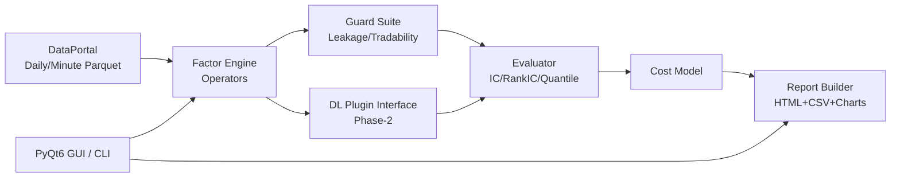
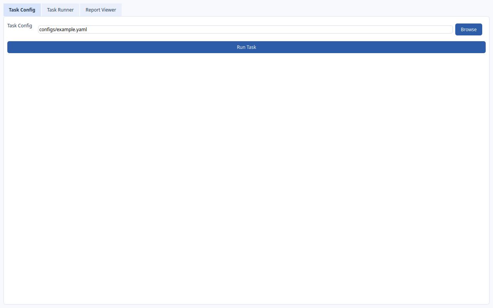
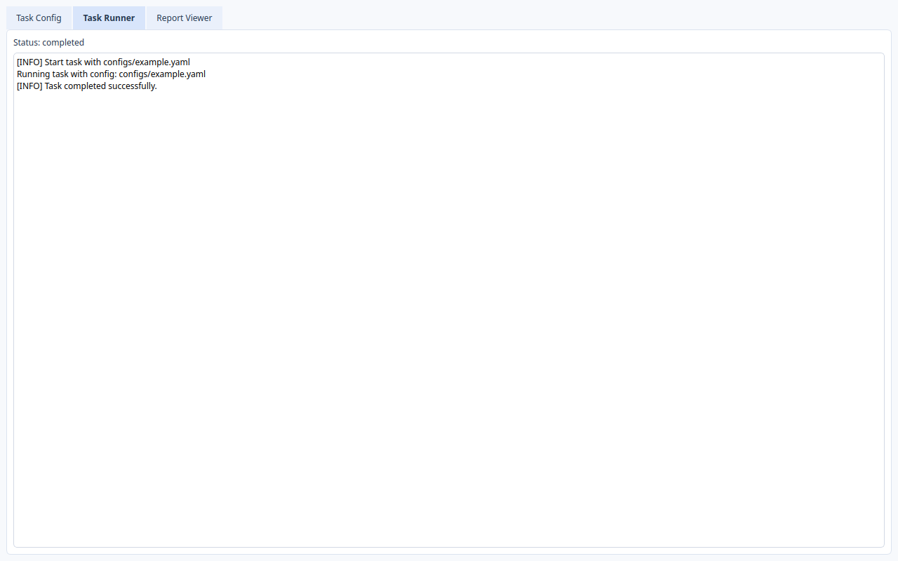
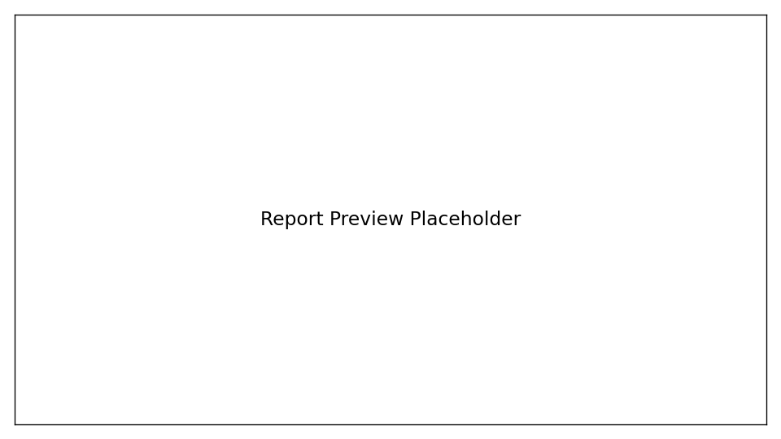

# Alpha-Lab

面向量化实习求职的开源因子研究工具链：把“因子生产 -> 验证 -> 迭代”做成可复现、可演示、可讲述的工程闭环。

## Why This Project (面试价值)

- **岗位对齐**：覆盖因子研究高频工作流（数据接入、算子构建、IC/分层评估、稳定性分析）。
- **工程化能力**：不仅会写脚本，还实现了配置化流水线、报告系统、回归测试和 CI。
- **量化研究意识**：内置未来函数检查、可交易性过滤、交易成本接口。
- **跨学科可迁移**：软件工程背景也能用可解释、可扩展的架构完成量化研究工具开发。

## 架构图位（可替换为你的正式图）

> 你可以将下图导出后放到 `docs/assets/architecture.png`，并替换本节图片链接。



## 项目亮点（可直接写进简历）

- 统一数据接口：支持日频/分钟级 Parquet 数据研究流程。
- 因子算子库：`rolling_mean`、`rank`、`zscore`、`decay_linear`、`winsorize`、`neutralize`。
- 评估报告一键生成：IC / RankIC、分层收益、多空收益、换手、稳定性、归因。
- 防坑机制：复权处理、停牌/涨跌停过滤、未来函数启发式检查。
- Phase-2 扩展：新增深度学习插件接口 `DLSpec + run_dl_plugin`，不破坏主流程。
- 双入口体验：CLI + PyQt6 简洁专业 GUI。

## Demo 截图位（可替换为你的真实截图）

> 建议放 3 张图：任务配置、运行日志、报告指标页。





若当前还没截图，可先使用占位图路径，提交前替换即可。

## Quick Start

```bash
python -m venv .venv
source .venv/bin/activate
pip install -e .[dev]

# 1) 生成演示数据
alpha-lab generate-demo-data --output data/demo

# 2) 运行传统因子流程
alpha-lab run --config configs/example.yaml

# 3) 运行含 DL 插件接口的流程
alpha-lab run --config configs/example_with_dl.yaml

# 4) 训练真实 DL 模型（TCN / Transformer）
pip install -e .[dl]
alpha-lab dl-train --config configs/example_dl_train_tcn.yaml
alpha-lab dl-infer --config configs/example_dl_infer_tcn.yaml

# 5) 打开 GUI
alpha-lab gui
```

## 目录结构

```text
alpha_lab/
  data/        # 数据读写与 demo 数据生成
  factors/     # 因子算子与表达式流水线
  guards/      # 未来函数/可交易性检查
  eval/        # 因子评估与统计
  costs/       # 交易成本模型
  report/      # HTML/CSV/图表报告
  dl/          # Phase-2 深度学习插件接口
  gui/         # PyQt6 可视化界面
  cli.py       # 命令行入口
configs/       # 示例任务配置
docs/          # 需求、设计、开发计划、回归规范
tests/         # 单元/集成测试
```

## Resume Pitch（建议话术）

你可以这样介绍本项目：

> 我实现了一个开源 Alpha 因子研究工具链，覆盖数据接入、因子构建、研究评估和报告输出，并加入未来函数与可交易性检查。  
> 同时我做了 GUI 演示和 CI 回归，让研究流程可复现、可扩展，后续还预留了深度学习插件接口用于策略迭代。

## Engineering & Docs

- 协作规范：`AGENTS.md`
- 需求文档：`docs/requirements.md`
- 设计文档：`docs/design.md`
- 开发计划：`docs/dev-plan.md`
- 回归规范：`docs/testing-regression.md`
- 变更记录：`docs/changelog.md`

## License

MIT
